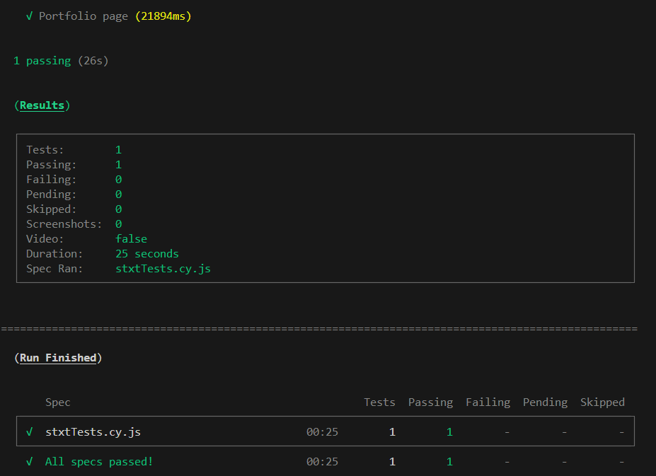

# Cypress E2E Tests

This project includes automated end-to-end tests written in [Cypress](https://www.cypress.io/) to validate key user flows and functionality within a web application.

## Installation

To get started, clone the repository and install the dependencies:

```console
git clone https://github.com/nataliagorska007/cypress-tests.git
cd cypress-tests
npm install

npx cypress open - cypress dashboard
npx cypress run - headless
```

## Improvements & Notes

- Improved selector naming for clarity and maintainability.
- Fixed various JavaScript-related issues in test logic.
- Added artificial delays to simulate slower loading environments and ensure element visibility.
- Updated and stabilized some selectors to better reflect changes in the DOM structure.
- General code cleanup and better organization for easier debugging and scalability.

## Results

All tests passed successfully under various loading conditions.

